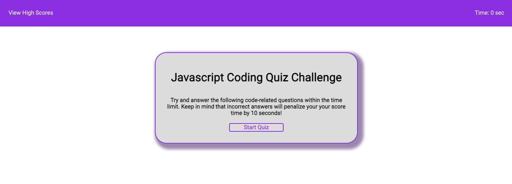

# JS-Code-Quiz

Week 4 Homework for OSU Bootcamp

## Description

This webpage uses DOM manipulation and Web API's to create a JavaScript coding quiz and saving the results to localStorage.

Check it out here https://youngin9210.github.io/JS-Code-Quiz/

## Table of Contents

- [Screenshots](#screenshots)
- [Installation](#installation)
- [Credits](#credits)
- [License](#license)
- [Badges](#badges)

## Screenshots

## Installation

Using the terminal, clone the repository to your local device using SSH or HTTPS. Once cloned, open repository in a text editor to make changes.

## Credits

Kyle Young https://github.com/Youngin9210

## License

## Badges

